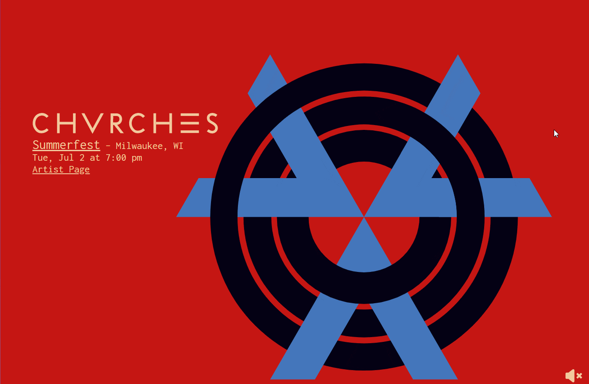
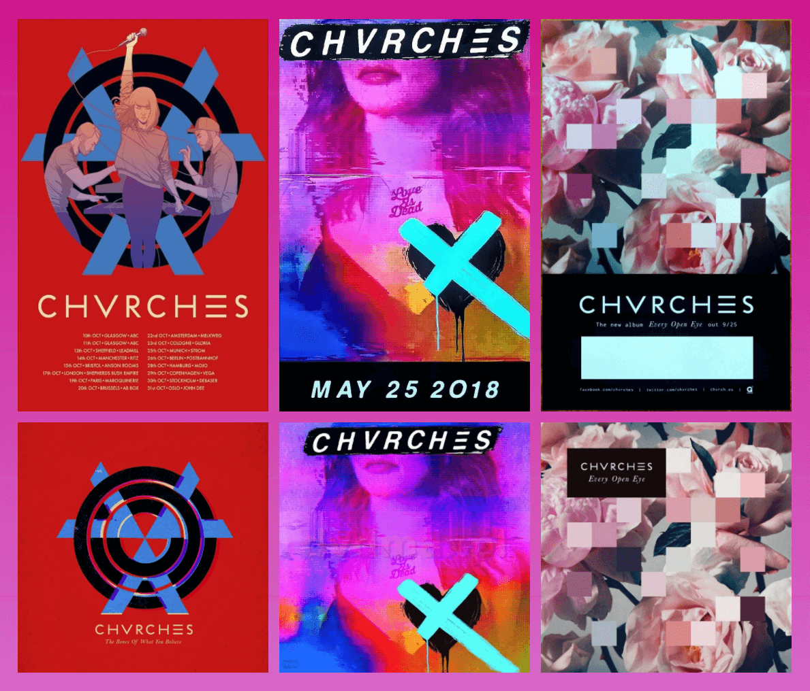
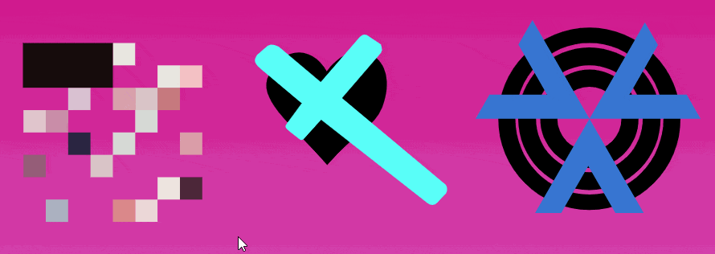
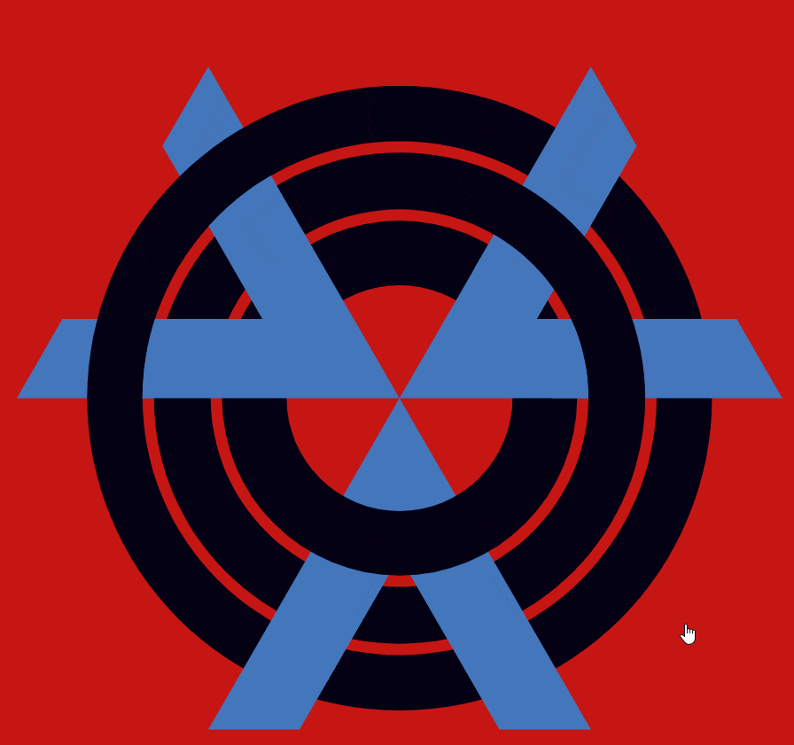

# CHVRCHES SVG Poster

This project is an SVG poster I created for a school assignment. The goal was to create an animated, interactive poster utilizing SVG to advertise for a band of our choice. I chose the band CHVRCHES and picked a random event they had planned on their current tour when I created this project. For more info on the development process read the page about it on my website [here](https://joshrouzer.com/chvrches-poster/).

## Project requirements

Required items:
* Looping animation - pulsing circles
* Interactive animation - "cutouts" popping up when circles are clicked, act as a toggle
* Interactive sound - a sample of their music plays when the circles are clicked, act as a toggle
* Button to event - Link in info block "Summerfest"
* Button to artist site - Link in info block "Artist Page"

Extra Items:
* Audio indicator in bottom right corner
* Audio volume controls in bottom right corner when sound is playing
* CHVRCHES logo draws itself in when page loads

## The Repo Layout

This was a school project as part of my minor in Interactive Digital Media so it was broken up into weekly assignments guiding us through the planning, design and development stages. I have condensed all of the planning into one "project" under the `planning-design` directory. This includes a working site that shows the inspiration album art and simple animations I tried out before landing on my final decision. The `layout-plan` folder includes basic wireframes pointing out all the interactions I planned to include in the final product. The `poster` folder includes the whole final poster project. It is a full npm project and uses `gulp` to build the styles from Sass so if you plan to run this make sure you go into that folder and run `npm install` and `npm run build`

## Project Samples

Reference Album Art:

Sample Animations:

Logo Animation:

Popup Animation:

## Credits

Audio and branding: © CHVRCHES

Illustrations: © Jamie McKelvie

Audio Control Icons by Adrien Coquet from the Noun Project
